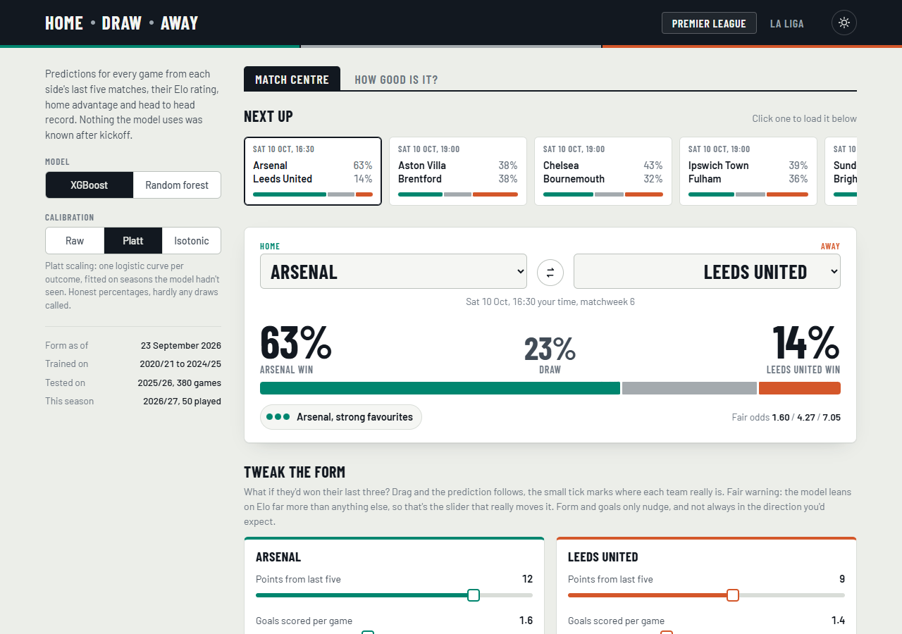
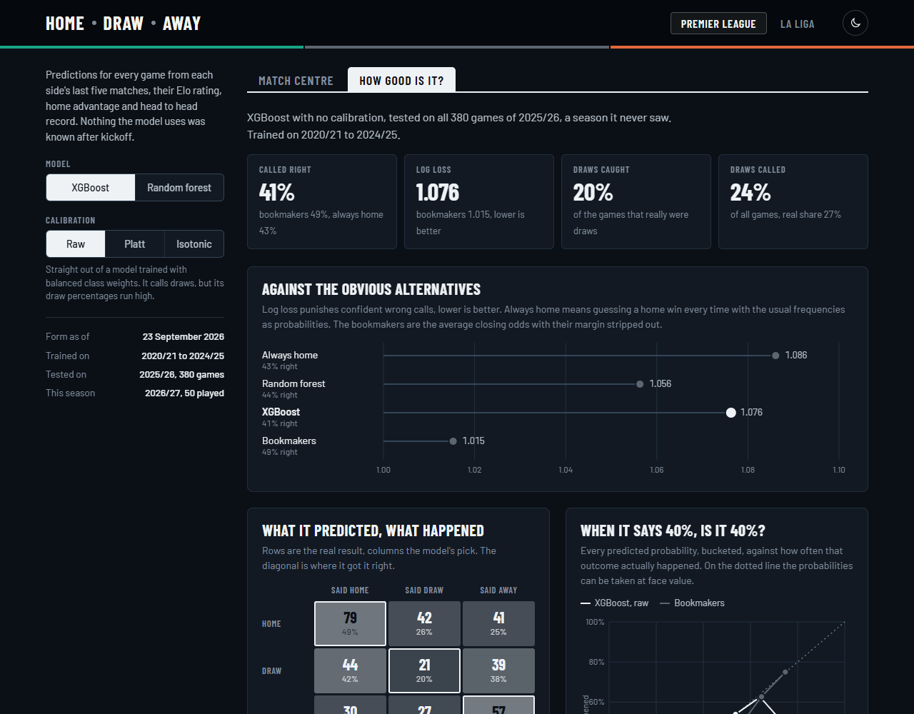

# match-outcome-predictor

Home win, draw or away win? This predicts Premier League and La Liga results from each team's recent form, their Elo rating, home advantage and head to head record, using nothing the model couldn't have known before kickoff.

The site (Home, Draw, Away) shows the next round of fixtures with probabilities, lets you set up any matchup and drag each side's form, goals, possession or Elo to see the prediction move, and has a page that's honest about how good the whole thing actually is. Short answer: decent, and the bookmakers are better.



## The two things that matter

**No peeking.** A model trained on season averages to predict a game in week five has already seen weeks six to thirty-eight. Every feature here comes from a `FormBook` that walks through the matches in date order: for each game it reads what it knows about both teams, then records the result, never the other way round. Tests check that deleting every later match doesn't change a single feature. They caught one leak on the way: the league-wide home advantage was counting games from earlier the same day, which is fine in real life but not in data where same-day kickoffs have no order.

**Draws.** About a quarter of games end level, but a draw is almost never the single most likely outcome, so a plain model never predicts one. Both models are trained with balanced class weights (`class_weight="balanced"` for the forest, the same weights as sample weights for XGBoost), and that gets them calling draws. The catch is that their percentages come out skewed towards draws, so each model also gets two calibration maps (Platt scaling and isotonic regression) fitted on walk forward predictions from the training seasons. The site lets you flip between them:

| 2025/26, Premier League, XGBoost | Called right | Log loss | Draws caught |
|---|---|---|---|
| Raw (balanced weights) | 41% | 1.076 | 20% |
| Platt calibrated | 48% | 1.039 | 0% |

Balanced weights catch one draw in five and get more of everything else wrong. Calibration gives honest percentages and stops calling draws altogether. There isn't a setting that gets both.

## Features

Per side, averaged over the last five league games within the past year: goals scored and conceded, shots on target for and against, possession, and form (3 for a win, 1 for a draw, over five games). Plus the head to head win rate over the last three seasons, the home side's own home advantage (points per game at home minus away), the league-wide home advantage over the last 380 games, and the Elo gap.

Elo wasn't in the original plan. Five games of form turned out to be a noisy read on how good a team is, and adding a plain Elo rating (K of 22, 55 points of home advantage, goal difference multiplier) cut the log loss more than anything else. Promoted sides with no top flight history start from a prior built from how promoted teams did in their first five games, using training seasons only.

## Results

Trained on 2020/21 to 2024/25, tested on all 380 games of 2025/26, which the model never saw. Log loss, lower is better:

| | Premier League | La Liga |
|---|---|---|
| Always predict a home win | 1.086 | 1.051 |
| Random forest, Platt | 1.041 | 0.992 |
| XGBoost, Platt | 1.039 | 0.987 |
| Bookmakers (average odds, margin removed) | 1.015 | 0.964 |

XGBoost with Platt calibration calls 48% of Premier League games and 52% of La Liga games right, against 49% and 54% for the bookmakers. Beating the market was never going to happen with free data, but it's comfortably ahead of the naive baseline and the probabilities are well calibrated (there's a reliability chart on the site).



## Things I found

- **Elo does nearly all the work.** Shuffle the Elo gap across the test season and log loss gets worse by 0.09. The next most useful input, the away side's form, manages 0.007. Once you know how good both teams are over the long run, the last five games add very little.
- **Behind closed doors, home advantage vanished.** In 2020/21 Premier League away sides took more points per game than home sides (a gap of minus 0.07, against around plus 0.4 in a normal season). La Liga's dropped from the mid 0.5s to 0.35. The league home advantage feature picks this up on its own.
- **The biggest shocks of 2025/26**, by the model's own numbers: Wolves 2-0 Aston Villa and Leeds 3-1 Chelsea (both about 7%), and Wolves 2-1 Liverpool (8%).
- **Form sliders can go the "wrong" way.** Push a side's form up and their win chance can drop by a point. It's the model being honest about how little form matters next to Elo, not a bug, and the site says so.

## Data

| What | Where from |
|---|---|
| Results, shots, shots on target, bookmaker odds, 2016/17 onwards | [football-data.co.uk](https://www.football-data.co.uk) |
| Possession, fixtures still to be played | [Sofascore](https://www.sofascore.com) |

The two are joined on season plus home and away team (each pair meets once at each ground per season), so a postponed game still lines up even when it moved date. Team names differ between the sources ("Nott'm Forest", "Ath Madrid"), so the mapping is learned from games both sources have: same day, same score.

Sofascore's possession needs one request per game. The first full crawl got my IP a temporary block after about 500 requests, so fetching is now slow on purpose and runs newest seasons first. Possession is still being filled in: every refresh fetches up to 400 more games. Games without it use the promoted-side prior, which barely changes anything given how little the models lean on possession.

## Running it

```bash
python -m venv .venv
.venv\Scripts\activate          # or: source .venv/bin/activate
pip install -r requirements.txt

python data_loader.py --max-stats 400   # results, fixtures, a batch of possession, features
python model.py                         # train, calibrate, evaluate, write reports/
python export_web.py                    # JSON for the site into web/data/
python -m pytest                        # leakage tests, and browser vs python predictions

python -m http.server 8000 --directory web
```

`python data_loader.py --offline` rebuilds the features from what's already downloaded.

## Deploying and keeping it fresh

Static site, so on Vercel it's import and deploy: `vercel.json` points at `web/` with no build step and `.vercelignore` keeps the Python side out.

`refresh.py` pulls new results and fixtures, fetches a batch of missing possession, retrains, re-exports, runs the tests, and pushes if anything changed, which makes Vercel redeploy. Sofascore blocks GitHub's servers, so it runs from a Windows scheduled task every morning instead of GitHub Actions:

```powershell
$action = New-ScheduledTaskAction -Execute "$PWD\.venv\Scripts\pythonw.exe" -Argument "refresh.py" -WorkingDirectory $PWD
$trigger = New-ScheduledTaskTrigger -Daily -At 8am
$settings = New-ScheduledTaskSettingsSet -StartWhenAvailable
Register-ScheduledTask -TaskName "match-outcome-predictor refresh" -Action $action -Trigger $trigger -Settings $settings
```

## Layout

```
data_loader.py    downloads, the team name mapping, the FormBook and Elo
model.py          temporal split, both models, calibration, baselines, charts
export_web.py     trees, calibration maps, team snapshots, fixtures, results to JSON
refresh.py        the whole thing plus commit and push, for the scheduled task
tests/            leakage tests, browser vs python predictions
web/              the site (plain HTML, CSS and JS modules)
```
